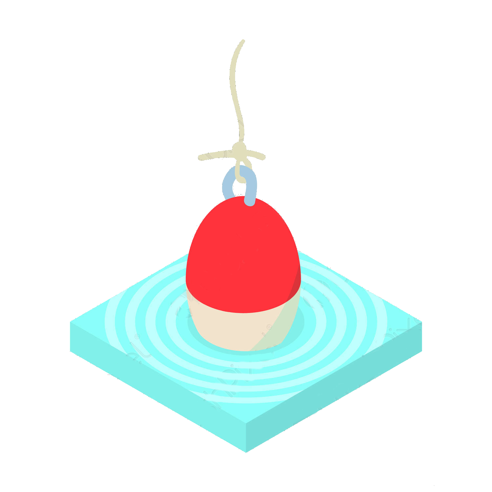
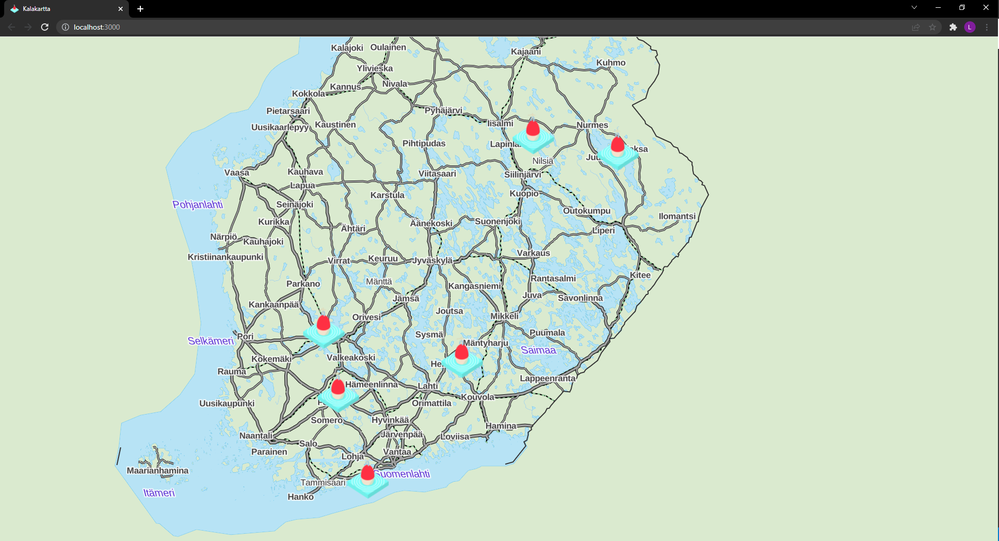

<!-- PROJECT LOGO -->

   
   <h3 align="center">Kalakartta</h3>
   

      Keep track of what fish you catch!
   

<!-- ABOUT THE PROJECT -->
## About The Project

### Built With

* [React.js](https://reactjs.org/)
* [Express.js](https://expressjs.com/)
* [MongoDB](https://www.mongodb.com/)
* [Mongoose.js](https://mongoosejs.com/)

<!-- ROADMAP -->
## Roadmap

- [x] Draw Map
- [x] Add Catch Reports on the map
- [x] Add images to Catch Reports
   - [x] Upload images to AWS S3 bucket
- [x] Ability to edit Catch Reports
   - [ ] Ability to change the image on the S3 bucket 
- [x] Ability to delete Catch Reports
   - [ ] Delete the image from S3 bucket aswell
- [ ] Write tests
.
.
.
- [ ] Launch on AWS 
   - [ ] Create Cloudformation templates
