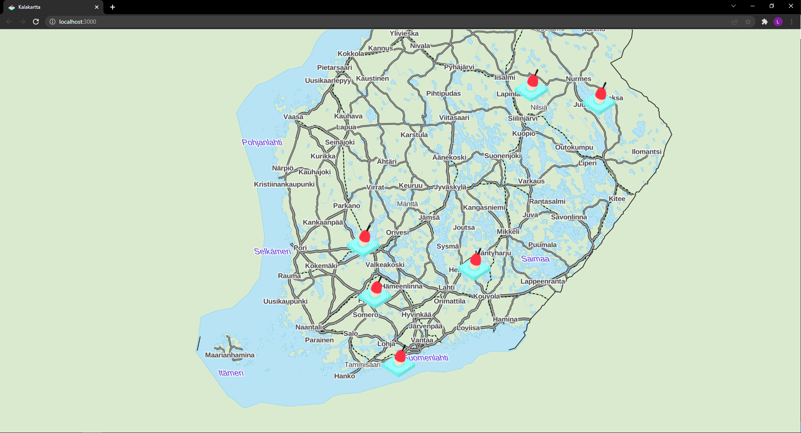

<!-- PROJECT LOGO -->
<div align="center">
   
   <h3 align="center">Kalakartta</h3>
   <p align="center">
      Keep track of what fish you catch!
   </p>
</div>

<!-- ABOUT THE PROJECT -->
## About The Project



### Built With

* [React.js](https://reactjs.org/)
* [Express.js](https://expressjs.com/)
* [MongoDB](https://www.mongodb.com/)
* [Mongoose.js](https://mongoosejs.com/)
* [Mapbox GL JS](https://www.mapbox.com/mapbox-gljs)
* [React Map GL](https://visgl.github.io/react-map-gl/)


<!-- ROADMAP -->
## Roadmap

- [x] Draw Map
- [x] Add Catch Reports on the map
- [x] Add images to Catch Reports
   - [x] Upload images to AWS S3 bucket
- [x] Ability to edit Catch Reports
   - [ ] Ability to change the image on the S3 bucket 
- [x] Ability to delete Catch Reports
   - [ ] Delete the image from S3 bucket aswell
- [ ] Styling
   - [ ] Popup
   - [ ] Catch Report Form
- [ ] Add Docker
  - [x] Dockerize the database with docker-compose.yaml
  - [ ] Dockerize the whole app with docker-compose.yaml
- [ ] Write tests
- [ ] Launch on AWS 
  

## How to run on your machine

1. Clone the repo to your machine
2. Move into the project directory
3. Get the database up and running with the command ```docker-compose up``` and close the database with the command ```docker-compose down```
4. Move into the server directory and run the commands:
   - ```npm install```
   - ```npm run dev```
5. Move into  the client directory and run the commands:
   - ```npm install```
   - ```npm start```

