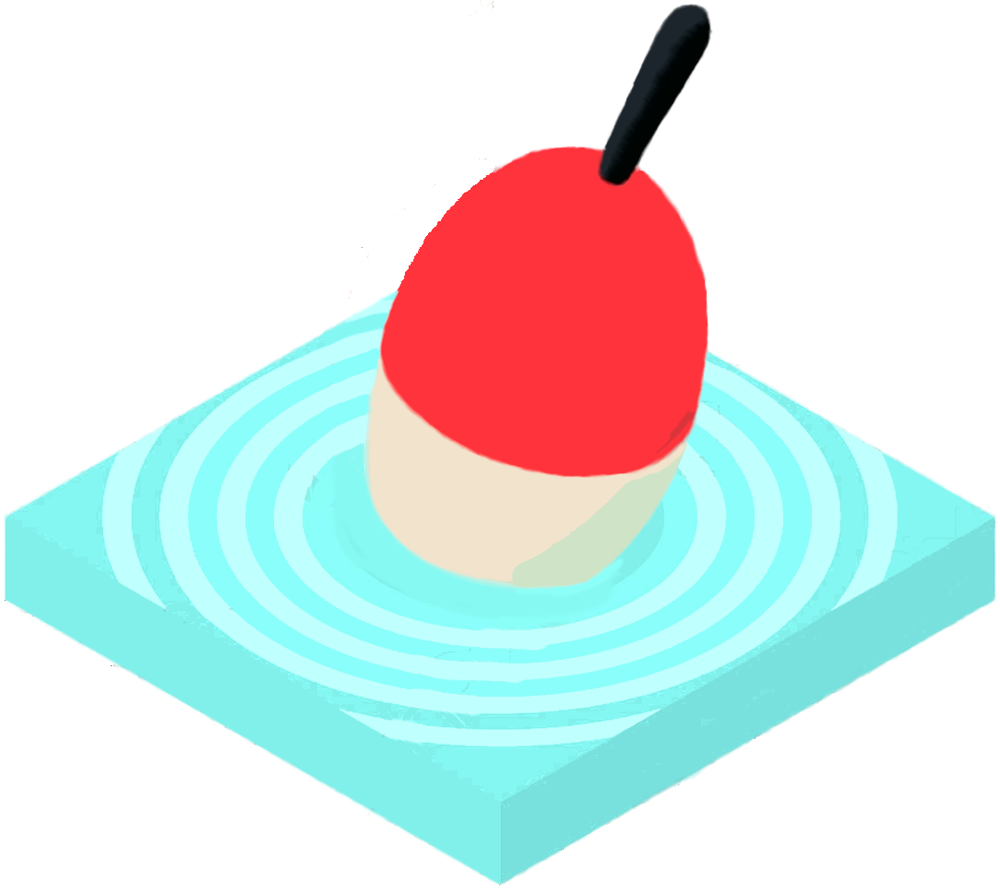

<!-- PROJECT LOGO -->

   
   <h3 align="center">Kalakartta</h3>
   

      Keep track of what fish you catch!
   

<!-- ABOUT THE PROJECT -->
## About The Project

### Built With

* [React.js](https://reactjs.org/)
* [Express.js](https://expressjs.com/)
* [MongoDB](https://www.mongodb.com/)
* [Mongoose.js](https://mongoosejs.com/)
* [Mapbox GL JS](https://www.mapbox.com/mapbox-gljs)
* [React Map GL](https://visgl.github.io/react-map-gl/)

<!-- ROADMAP -->
## Roadmap

- [x] Draw Map
- [x] Add Catch Reports on the map
- [x] Add images to Catch Reports
   - [x] Upload images to AWS S3 bucket
- [x] Ability to edit Catch Reports
   - [ ] Ability to change the image on the S3 bucket 
- [x] Ability to delete Catch Reports
   - [ ] Delete the image from S3 bucket aswell
- [ ] Styling
   - [ ] Popup
   - [ ] Catch Report Form
- [ ] Write tests
- [ ] Launch on AWS 
   - [ ] Create Cloudformation templates

## How to run on your machine

1. clone the repo to your machine
2. move into the project directory
3. run npm install
4. get the db up and running with the command *docker-compose up*
5. move into the server directory and run the commands:
   - *npm install*
   - *npm run dev*
6. move into  the client directory and run the commands:
   - *npm install*
   - *npm start*

